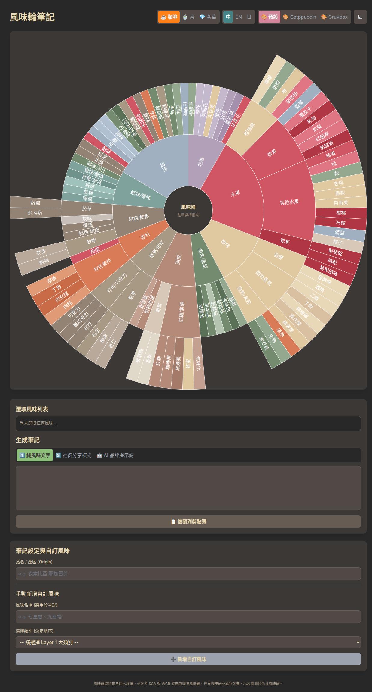

# Flavor Wheel Note | 風味輪筆記

[](https://opensource.org/licenses/MIT)
[](https://github.com/alvin999/FlavorWheelNote)
[](https://github.com/alvin999/FlavorWheelNote)

> **專為咖啡、茶品愛好者與品評師設計的互動式風味輪筆記工具。**
>
> An interactive flavor wheel note-taking tool designed for coffee, tea lovers, and professional cuppers.

這款工具讓您能透過點擊直觀的風味輪，輕鬆記錄、整理並生成專業的品飲筆記。無論您是剛入門的愛好者，還是經驗豐富的專家，都能從中受益。

---

### ✨ 線上體驗 (Live Demo)

**[點此體驗 Flavor Wheel Note](https://alvin999.github.io/FlavorWheelNote/)**

### 📸 畫面預覽 (Screenshots)

<p align="center">
  
</p>

---

## 🚀 主要功能 (Key Features)

- **🎨 多種風味輪與主題 (Multiple Wheels & Themes)**
  - 內建**咖啡**、**臺灣特色茶**及**奢華精品**三種風味輪，一鍵切換。
  - 支援多種顏色主題 (如 Gruvbox, Catppuccin)，並為不同風味輪提供專屬主題。

- **🌐 多國語言支援 (Multilingual Support)**
  - 自動偵測瀏覽器偏好語言，並提供**繁體中文**、**英文**、**日文**介面。
  - 可手動切換語言，滿足不同地區使用者的需求。

- **✍️ 智慧筆記生成 (Intelligent Note Generation)**
  - **純文字模式**: 快速生成以頓號或逗號分隔的風味列表。
  - **社群分享模式**: 自動套用模板，生成適合分享到社群媒體的品飲短文。
  - **AI 提示詞模式**: 一鍵生成專業的 AI 提示詞 (Prompt)，讓您能請 AI 寫出更生動的品評筆記。

- **🖱️ 流暢的互動體驗 (Smooth Interactive Experience)**
  - 使用 D3.js 打造，風味輪的選取、切換與語言變更都具備平滑的過渡動畫。
  - 響應式設計，在桌面和行動裝置上都有良好的操作體驗。

- **🔧 高度客製化 (Highly Customizable)**
  - 可手動輸入並新增風味輪上沒有的「自訂風味」。
  - 可輸入飲品名稱或產區，並自動應用到筆記中。

- **🔄 便捷的風味管理 (Convenient Flavor Management)**
  - **點擊刪除**: 在下方的選取列表中，直接點擊風味標籤即可將其移除。
  - **一鍵重設**: 提供重設按鈕，可快速清空所有已選取的風味。

- **🌓 深色模式 (Dark Mode)**
  - 支援手動切換深色模式，並能自動根據您的系統偏好設定。

---

## 🛠️ 技術棧 (Technology Stack)

- **前端框架 (Frontend Framework)**: 無 (原生 HTML, CSS, JavaScript)
- **視覺化 (Visualization)**: [D3.js (v7)](https://d3js.org/)
- **CSS 框架 (CSS Framework)**: [Tailwind CSS](https://tailwindcss.com/)
- **本地化 (Localization)**: 原生 JavaScript 物件

---

## 本地開發 (Local Development)

您可以輕易地在本地端運行此專案。

1.  **Clone 儲存庫**
    ```bash
    git clone https://github.com/alvin999/FlavorWheelNote.git
    cd FlavorWheelNote
    ```

2.  **啟動本地伺服器**
    由於此專案使用 `fetch` API 載入 `.json` 檔案，直接用瀏覽器開啟 `index.html` 會遇到 CORS 跨域錯誤。您需要一個本地伺服器來運行。

    如果您有安裝 Python，可以使用內建的伺服器：
    ```bash
    # Python 3
    python -m http.server
    ```

    或者，如果您有安裝 Node.js，可以安裝並使用 `live-server`：
    ```bash
    npm install -g live-server
    live-server
    ```

3.  **開啟瀏覽器**
    在瀏覽器中開啟 `http://localhost:8000` (或 `live-server` 提供的網址)。

---

## 🤝 貢獻 (Contributing)

歡迎各種形式的貢獻！無論是回報問題 (Issues)、提交功能請求 (Pull Requests)，或是為風味輪資料提供建議，都對這個專案有極大的幫助。

---

## 📄 授權 (License)

本專案採用 MIT License 授權。

---

*Made with ❤️ for all coffee and tea lovers.*